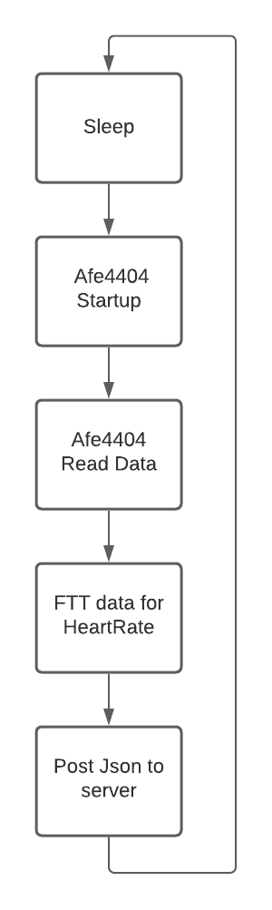

# ESP32ProjecrtHeartbeat
The goal of this firmware is to calculate heartbeat from an spo2 sensor, then extract a stress factor and send all of this to a server. 

# Hardware
## Microcontroller
The microcontroller we use here is an ESP32.
## SPO2 Sensor
The used SPO2 sensor and chip used for testing where the afe4404 (adc/controller), vemd8080 (fotodiode) and 2 green leds.

# Block digram
## Envisioned procedure for the Firmware

# External Links and repositorys
## related repositorys
old repository: https://github.com/SoenensBram/HorlogeESP8622
Server repository: https://github.com/bryanvolckaertschool/Projectheartbeat
Website: https://vzwheartbeats.be/