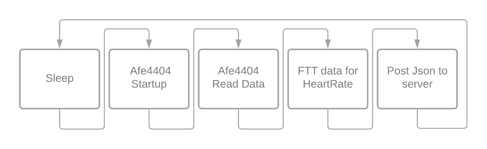

# ESP32ProjectHeartbeat
The goal of this firmware is to calculate heartrate from an spo2 sensor and send this to an on-site server. 

# Hardware
## Microcontroller
The microcontroller we use here is an ESP32.
## SPO2 Sensor
The used SPO2 sensor and chip used for testing where the afe4404 (adc/controller), vemd8080 (fotodiode) and 2 green leds.

# How to get started
## Toolchain and esp-idf installation
https://docs.espressif.com/projects/esp-idf/en/latest/esp32/get-started/index.html#introduction

## Connections
Assuming you use the same sensor and esp32 you will have to connect them as following:
Sensor - ESP32
3V3 and ground - to their respective pins on the esp
SDA - G14
SCL - G2

## Changing settings

## How to flash
Once you have followed the before mentioned toolchain and esp-idf, connected the afe4404 board and your ESP32. Then you can start to flash to the esp32.

# Block digram
## Envisioned procedure for the Firmware

# External Links and repositorys
## related repositorys
Server repository: https://github.com/bryanvolckaertschool/Projectheartbeat

Website: https://vzwheartbeats.be/

Old repository: https://github.com/SoenensBram/HorlogeESP8622
